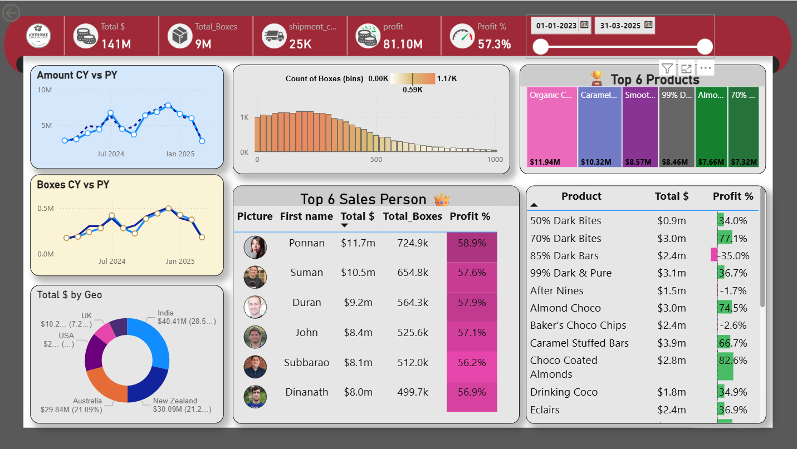

# Power-BI
: My first Power BI dashboard project using chocolate sales data.
# 🍫 Power BI Chocolate Sales Dashboard

This is my **first Power BI project**, where I analyzed and visualized chocolate shipments and sales data from 2023 to 2025.

## 🔍 Project Overview

The dashboard provides key insights into:
- Total Sales, Shipments, Boxes, and Profit %
- Sales trends (CY vs PY)
- Top-performing Salespeople & Products
- Geo-wise revenue distribution
- Product-wise profit analysis

## 📁 Files Included
- `Chocolate_Sales_Dashboard.pbix` – Power BI report
- `sample-chocolate-shipments-data-all-Apr-2025.xlsx` – Raw dataset
- `dashboard-preview.png` – Screenshot of the final dashboard

## 🛠 Skills & Tools Used
- Power BI
- Power Query
- DAX (including VAR, YOY comparisons, measures)
- Report visuals: Line Charts, Treemap, Donut Chart, KPI cards, Slicers

## 📷 Dashboard Preview

---

## 📌 Key Learnings
- End-to-end report building with Power BI
- Using star schema for data modeling
- Creating interactive reports with custom visuals and filters
- Applying conditional formatting and dynamic visuals

---

💬 Feel free to explore the files or reach out for collaboration!

